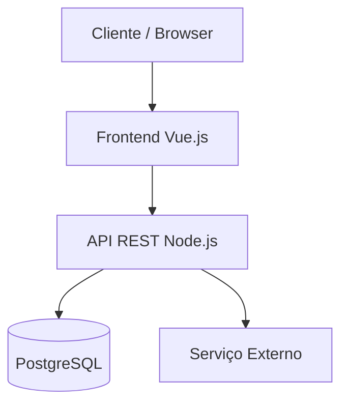

# [Nome do Projeto] - Arquitetura de Software (Hub IA-First)

> **Tipo de documento:** Hub de Arquitetura (central + módulos)
> **Localização obrigatória:** `_docs/ARCHITECTURE.md`

## Índice Navegável

- [Guia de Uso da Documentação](#guia-de-uso-da-documentação)
- [1. Visão Arquitetural](#1-visão-arquitetural)
- [2. Stack de Tecnologias (Resumo)](#2-stack-de-tecnologias-resumo)
- [3. Diagrama de Arquitetura](#3-diagrama-de-arquitetura)
- [4. Estrutura IA-First de Documentação](#4-estrutura-ia-first-de-documentação)
- [5. Mapa de Módulos Arquiteturais](#5-mapa-de-módulos-arquiteturais)
- [6. Contratos e Decisões Centrais](#6-contratos-e-decisões-centrais)
- [7. Arquivos Importantes](#7-arquivos-importantes)
- [8. Dependências Externas e Integrações](#8-dependências-externas-e-integrações)
- [9. Histórico de Ondas e Changelog](#9-histórico-de-ondas-e-changelog)

---

## Guia de Uso da Documentação

### Para leitura humana (onboarding)

1. Ler este hub por completo;
2. Navegar para os módulos conforme o tema da tarefa.

### Para uso com IA (recuperação eficiente)

1. Consultar primeiro este hub para contexto e contratos;
2. Buscar o módulo específico do domínio afetado;
3. Evitar carregar módulos não relacionados para reduzir ruído de contexto e custo de tokens.

### Regra de atualização

- mudanças de contrato global devem atualizar o hub **e** o módulo afetado;
- mudanças locais de implementação devem atualizar somente o módulo correspondente;
- manter links bidirecionais entre hub e módulos.

---

## 1. Visão Arquitetural

Descreva o estilo arquitetural adotado (ex: MVC, Hexagonal, Microsserviços, Monólito Modular) e a justificativa da escolha.

## 2. Stack de Tecnologias (Resumo)

| Camada         | Tecnologia       | Versão | Justificativa |
| -------------- | ---------------- | ------ | ------------- |
| Frontend       | Vue.js           | 3.x    | ...           |
| Backend        | Node.js          | 20.x   | ...           |
| Banco de dados | PostgreSQL       | 15     | ...           |
| Infraestrutura | Docker + Compose | 24.x   | ...           |

## 3. Diagrama de Arquitetura

Use a regra abaixo:

- **ASCII** para diagramas simples (até poucos nós/fluxos curtos).
- **Mermaid** para diagramas médios/complexos (sequência, ER, Gantt, C4, fluxos densos).

### Exemplo ASCII (simples)

```ascii
Cliente
  |
  v
Frontend --> API --> Banco
```

### Exemplo Mermaid (mais estruturado)



## 4. Estrutura IA-First de Documentação

Padrão adotado: **hub central + módulos especializados**.

- O hub (`_docs/ARCHITECTURE.md`) concentra visão, contratos e mapa de navegação;
- O detalhamento técnico fica em `_docs/architecture/*.md`;
- Cada módulo deve declarar escopo, arquivos-fonte e gatilhos de atualização.

```filesystem
_docs/
├── ARCHITECTURE.md                # Hub central (este documento)
└── architecture/
    ├── frontend.md                # UI/editor, rotas e serviços de frontend
    ├── backend.md                 # Runtime backend, rotas, persistência
    ├── security.md                # Segurança, auth, riscos e controles
    └── operations.md              # Build, deploy, observabilidade e operação
```

## 5. Mapa de Módulos Arquiteturais

Liste os módulos com links e responsabilidades:

- [Frontend](./architecture/frontend.md) — camada de UI, componentes e fluxos do browser.
- [Backend](./architecture/backend.md) — execução backend, contratos HTTP/WS e persistência.
- [Segurança](./architecture/security.md) — autenticação/autorização, controles e riscos.
- [Operações](./architecture/operations.md) — execução local, deploy, env e publicação.

## 6. Contratos e Decisões Centrais

### 6.1 Contratos globais

Descreva contratos arquiteturais globais que afetam múltiplos módulos.

### 6.2 Decisões arquiteturais centrais

Liste decisões que orientam o sistema como um todo e, quando aplicável, relacione ADRs.

### 6.3 Limitações conhecidas (resumo)

Registre limitações estruturais atuais e impactos esperados.

## 7. Arquivos Importantes

- `_docs/ARCHITECTURE.md` — hub arquitetural (fonte de verdade central).
- `_docs/architecture/*.md` — módulos especializados de arquitetura IA-first.
- `src/server.ts` — exemplo de ponto de entrada backend.
- `src/...` — arquivos relevantes por domínio (referenciar módulo).

## 8. Dependências Externas e Integrações

Liste serviços externos, APIs de terceiros e outros projetos dos quais este projeto depende.

| Dependência       | Tipo            | Contato/Link | Criticidade | Introduzida na Onda |
| ----------------- | --------------- | ------------ | ----------- | ------------------- |
| API de Pagamentos | Serviço externo | link         | Alta        | Onda 2              |
| Serviço de Auth   | Projeto interno | link/repo    | Alta        | Onda 1              |

## 9. Histórico de Ondas e Changelog

### 9.1 Registro de Ondas

- **Onda 1 — MVP**
  - **Principais Alterações Arquiteturais:** [Descreva]
  - **ADRs Relacionados:** [ADR-001](./1-mvp/decisoes/ADR-001-stack-inicial.md)

### 9.2 Changelog do Documento

- **Versão X.Y**
  - **Data:** AAAA-MM-DD
  - **Autor:** Nome
  - **Mudanças:** [Resumo objetivo do que mudou no hub e/ou módulos]

## 10. Diretriz de Diagramas

- Prefira **ASCII** quando o objetivo for velocidade, diff fácil em git e leitura textual imediata.
- Use **Mermaid** quando o diagrama exigir maior expressividade visual e estrutura formal.
