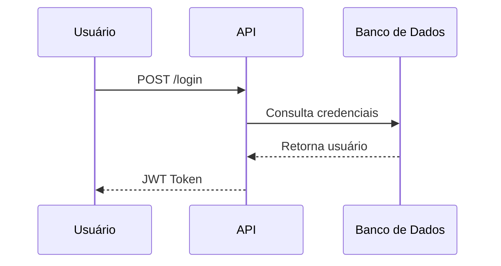
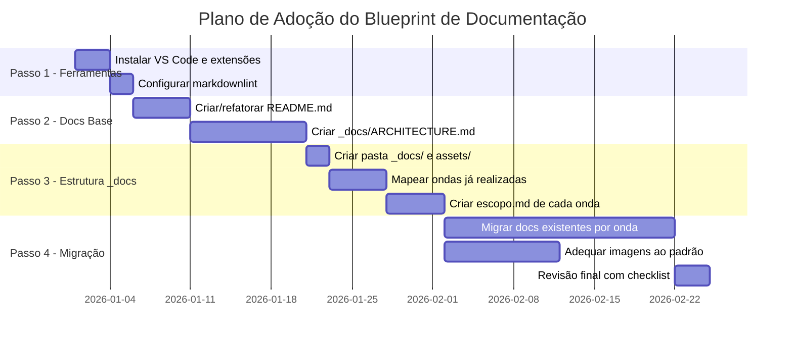

# Blueprint de Documentação Técnica para Projetos de Software

> **Versão:** 1.0  
> **Data:** Fevereiro de 2026  
> **Público-alvo:** Empresas terceirizadas, parceiros de desenvolvimento e equipes internas

---

## Índice

1. [Introdução e Objetivo](#1-introdução-e-objetivo)
2. [Padrão de Escrita: Markdown e GFM](#2-padrão-de-escrita-markdown-e-gfm)
3. [Estrutura Obrigatória de Documentação](#3-estrutura-obrigatória-de-documentação)
4. [README.md — Visão Geral do Projeto](#4-readmemd--visão-geral-do-projeto)
5. [_docs/ARCHITECTURE.md — Arquitetura e Decisões Técnicas](#5-_docsarchitecturemd--arquitetura-e-decisões-técnicas)
6. [Pasta `_docs` — Documentação do Projeto](#6-pasta-_docs--documentação-do-projeto)
7. [Padrão de Imagens e Diagramas](#7-padrão-de-imagens-e-diagramas)
8. [Ferramentas Recomendadas para elaborar documentação técnica](#8-ferramentas-recomendadas-para-elaborar-documentação-técnica)
9. [Checklist de Conformidade](#9-checklist-de-conformidade)
10. [Adoção em Projetos Existentes](#10-adoção-em-projetos-existentes)

---

## 1. Introdução e Objetivo

Este documento é o **blueprint oficial de documentação de software**, estabelecido como padrão para todos os projetos desenvolvidos em escopo corporativo. Ele define diretrizes, estruturas e ferramentas que devem ser adotadas em:

- **Novos projetos:** seguir este padrão desde o início.
- **Projetos em andamento:** migrar gradualmente para esta estrutura.
- **Projetos legados:** traduzir e adequar a documentação existente para este formato.

A adoção uniforme deste padrão garante:

- Onboarding mais rápido de novos desenvolvedores.
- Rastreabilidade de decisões técnicas e arquiteturais por onda de desenvolvimento.
- Facilidade de manutenção e evolução do projeto ao longo do tempo.
- Compatibilidade com ferramentas de IA, linters e pipelines de CI/CD.
- Comunicação clara entre times, clientes e parceiros.

*Este documento é parte do padrão corporativo de documentação técnica em formato Docs-as-Code (Documentação como Código). Em caso de dúvidas ou sugestões de melhoria, entre em contato com a equipe de arquitetura.*

### Estratégia de Ondas de Desenvolvimento

A documentação complementar de cada projeto é organizada em **ondas de desenvolvimento**. Cada onda representa um ciclo de entrega coeso — com escopo, requisitos, reuniões e ajustes próprios — e é registrada de forma isolada dentro da pasta `_docs/`.

| Onda                    | Descrição                                                                                                                                                                        |
| ----------------------- | -------------------------------------------------------------------------------------------------------------------------------------------------------------------------------- |
| **Onda 1 — MVP**        | Primeira entrega funcional do produto. Define a base do sistema, as funcionalidades essenciais e as decisões arquiteturais fundacionais.                                         |
| **Onda 2+ — Evoluções** | Cada evolução subsequente é numerada e nomeada por seu tema central (ex: `2-modulo-pagamentos`, `3-app-mobile`). Contém somente a documentação referente ao escopo daquela onda. |

Essa organização permite:

- Rastrear exatamente quais requisitos, decisões e ajustes pertenceram a cada ciclo de entrega.
- Auditar o histórico de evolução do produto de forma cronológica e isolada.
- Integrar novos desenvolvedores em ondas específicas sem navegar por toda a documentação do projeto.
- Facilitar negociações de escopo, pois cada onda tem seu próprio registro de decisões e mudanças.

No contexto da *metodologia ágil*, cada onda pode ser alinhada a um **relsease específico** (e não a um único sprint). Assim, ao revisar o histórico de ondas, é possível entender a evolução do produto em cada release, quais funcionalidades foram entregues, quais decisões técnicas foram tomadas e quais ajustes ocorreram durante o ciclo de desenvolvimento.

---

## 2. Padrão de Escrita: Markdown e GFM

### 2.1 Por que Markdown?

Markdown é o **padrão de facto** da indústria de software para documentação técnica. Embora não seja um padrão oficial de órgãos como W3C ou ISO, é amplamente aceito pela comunidade técnica mundial e suportado nativamente por GitHub, GitLab, Bitbucket, Jira, Notion, VS Code e diversas outras ferramentas do ecossistema de desenvolvimento.

- **Origem:** Criado por John Gruber em 2004, com colaboração de Aaron Swartz.
- **Especificação de referência:** [CommonMark](https://spec.commonmark.org/) — a tentativa mais rigorosa de padronização técnica, adotada por Stack Overflow, GitHub e outras grandes plataformas.
- **Especificação oficial adotada:** [GitHub Flavored Markdown (GFM)](https://github.github.com/gfm/) — extensão do CommonMark com suporte a tabelas, task lists, strikethrough e autolinks.

### 2.2 Especificação GFM — Recursos Adicionais ao CommonMark

O GFM adiciona os seguintes recursos essenciais ao CommonMark puro:

| Recurso           | Sintaxe              | Descrição                                                     |
| ----------------- | -------------------- | ------------------------------------------------------------- |
| **Tabelas**       | `\| col1 \| col2 \|` | Criação de tabelas com barras verticais.                      |
| **Task Lists**    | `- [ ]` / `- [x]`    | Listas de tarefas interativas.                                |
| **Strikethrough** | `~~texto~~`          | Texto tachado.                                                |
| **Autolinks**     | URL literal          | Conversão automática de URLs em links clicáveis.              |
| **Menções**       | `@usuario`           | Referência a usuários (suportado em plataformas como GitHub). |

### 2.3 Diretrizes de Estilo

- Todo arquivo de documentação **deve** começar com um cabeçalho `H1` (`#`).
- Use cabeçalhos hierárquicos: nunca pule níveis (ex: não use `###` diretamente após `#`).
- Insira uma linha em branco antes e depois de blocos de código, listas e tabelas.
- Limite o tamanho das linhas a **120 caracteres** sempre que possível (facilita diffs em git).
- Escreva o Alt Text de **todas** as imagens: ``
- Prefira **paths relativos** ao referenciar arquivos internos ao projeto.

### 2.4 Referências de Especificação

- Especificação CommonMark: <https://spec.commonmark.org/>
- Especificação GFM: <https://github.github.com/gfm/>
- Ferramenta de validação online CommonMark: <https://spec.commonmark.org/dingus/>
- Guia de sintaxe rápida GitHub: <https://docs.github.com/en/get-started/writing-on-github>

---

## 3. Estrutura Obrigatória de Documentação

Cada projeto de software deve conter, **obrigatoriamente**, a seguinte estrutura de documentação.

A pasta `_docs/` é o **repositório centralizado da documentação técnica** do projeto, incluindo o arquivo de arquitetura:

```filesystem
raiz-do-projeto/
├── README.md              # Visão geral e onboarding
└── _docs/                 # Repositório centralizado de documentação
    ├── ARCHITECTURE.md      # Hub arquitetural (resumo, contratos, navegação)
    ├── architecture/        # Módulos arquiteturais especializados
    │   ├── frontend.md
    │   ├── backend.md
    │   └── security.md
    ├── assets/              # Imagens e mídias compartilhadas
    │   ├── screenshots/
    │   └── logos/
    ├── 1-mvp/               # Onda 1: MVP - Minimum Viable Product
    │   ├── escopo.md
    │   ├── requisitos/
    │   ├── reunioes/
    │   ├── testes/
    │   ├── decisoes/
    │   └── ajustes/
    ├── 2-evolucao-xyz/      # Onda 2: [nome do tema]
    │   ├── escopo.md
    │   ├── requisitos/
    │   ├── reunioes/
    │   ├── testes/
    │   ├── decisoes/
    │   └── ajustes/
    └── 3-evolucao-xpto/     # Onda 3: [nome do tema]
        ├── escopo.md
        ├── requisitos/
        ├── reunioes/
        ├── testes/
        ├── decisoes/
        └── ajustes/
```

### Padrão recomendado para arquitetura: Hub + Módulos

Para reduzir tamanho de arquivo, custo de contexto e ruído em fluxos com IA:

- usar `_docs/ARCHITECTURE.md` como **hub enxuto** (visão geral, contratos, decisões centrais e links);
- mover detalhamento por domínio para `_docs/architecture/*.md`;
- manter links bidirecionais entre hub e módulos;
- atualizar apenas o módulo impactado em mudanças locais.

### Convenção de Nomenclatura das Ondas

As subpastas de onda dentro de `_docs/` devem seguir o padrão:

```markdown
{número incremental}-{slug-descritivo}/
```

Exemplos:

- `1-mvp/`
- `2-modulo-pagamentos/`
- `3-app-mobile/`
- `4-integracao-erp/`

O número garante ordenação cronológica. O slug descreve o tema central da onda.

### Resumo dos Itens Obrigatórios

- `README.md` — **Obrigatório**. Apresentação, onboarding e links para demais docs.
- `_docs/ARCHITECTURE.md` — **Obrigatório**. Hub arquitetural com visão, contratos centrais e mapa de módulos.
- `_docs/architecture/` — **Obrigatório**. Módulos especializados para detalhamento por domínio e otimização de contexto.
- `_docs/` — **Obrigatório**. Repositório centralizado da documentação do projeto, organizado por ondas.
- `_docs/assets/` — **Obrigatório**. Imagens e mídias compartilhadas entre ondas.
- `_docs/1-mvp/` — **Obrigatório**. Documentação da primeira onda (MVP), deve existir em todo projeto.
- `_docs/N-onda/escopo.md` — **Obrigatório por onda**. Arquivo de escopo que resume os objetivos e entregas de cada onda.

---

## 4. `README.md` — Visão Geral do Projeto

O `README.md` é o **ponto de entrada** de qualquer desenvolvedor ou stakeholder que acessa o repositório. Deve ser objetivo, atualizado e funcional.

### 4.1 Estrutura Obrigatória do README.md

Veja modelo completo em [blueprint-doc-README-model.md](./blueprint-doc-README-model.md).

### 4.2 Boas Práticas para o README.md

- Mantenha o README **sempre atualizado** a cada release significativo.
- Evite explicações excessivamente técnicas — o README é para todos os perfis de leitores e analistas.
- Não inclua senhas, tokens ou dados sensíveis. Referencie o `.env.example` se necessário.

---

## 5. `_docs/ARCHITECTURE.md` — Arquitetura e Decisões Técnicas

O `_docs/ARCHITECTURE.md` é o **hub de arquitetura** do projeto. Deve permanecer objetivo, com decisões e contratos centrais, apontando para módulos em `_docs/architecture/*.md`.

### 5.1 Estrutura Obrigatória do ARCHITECTURE.md

Veja modelo completo em [blueprint-doc-ARCHITECTURE-model.md](./blueprint-doc-ARCHITECTURE-model.md).

---

## 6. Pasta `_docs` — Documentação do Projeto

Toda documentação técnica (incluindo o `ARCHITECTURE.md`) deve residir na pasta `_docs`, com arquitetura no padrão **hub + módulos** e documentação funcional **organizada por onda de desenvolvimento**.

### 6.1 Estrutura por Onda

```filesystem
_docs/
│
├── ARCHITECTURE.md                  # Referência à arquitetura geral do projeto
├── architecture/                    # Módulos arquiteturais por domínio
│   ├── frontend-editor.md
│   ├── backend-runtime.md
│   ├── security.md
│   └── deploy-operations.md
│
├── assets/                          # Imagens compartilhadas entre ondas
│   ├── screenshots/
│   └── logos/
│
├── 1-mvp/                           # Onda 1 — MVP
│   ├── escopo.md                    # Resumo dos objetivos e entregas da onda
│   ├── requisitos/
│   │   ├── RF-001-autenticacao.md
│   │   └── RNF-001-performance.md
│   ├── reunioes/
│   │   ├── 2026-01-10-kickoff.md
│   │   └── 2026-02-05-revisao-sprint-2.md
│   ├── testes/
│   │   ├── plano-de-testes.md
│   │   └── relatorio-teste-aceitacao.md
│   ├── decisoes/
│   │   └── ADR-001-escolha-stack.md
│   └── ajustes/
│       └── 2026-02-15-ajuste-fluxo-login.md
│
└── 2-modulo-pagamentos/             # Onda 2 — Evolução
    ├── escopo.md
    ├── requisitos/
    ├── reunioes/
    ├── testes/
    ├── decisoes/
    └── ajustes/
```

### 6.2 Subdiretórios de Cada Onda

| Subdiretório  | Conteúdo                                                                                       | Nomenclatura dos Arquivos                       |
| ------------- | ---------------------------------------------------------------------------------------------- | ----------------------------------------------- |
| `escopo.md`   | Arquivo único que define o objetivo, funcionalidades planejadas e critérios de aceite da onda. | `escopo.md` (fixo)                              |
| `requisitos/` | Requisitos funcionais e não-funcionais levantados para esta onda.                              | `RF-XXX-nome.md`, `RNF-XXX-nome.md`             |
| `reunioes/`   | Atas de reuniões, decisões de refinamento, alinhamentos com cliente.                           | `AAAA-MM-DD-tema.md`                            |
| `testes/`     | Planos de teste, relatórios de execução, evidências de aceite.                                 | `plano-de-testes.md`, `relatorio-AAAA-MM-DD.md` |
| `decisoes/`   | Architecture Decision Records (ADRs) e decisões técnicas relevantes da onda.                   | `ADR-XXX-decisao.md`                            |
| `ajustes/`    | Registro de mudanças de escopo, correções e ajustes acordados durante ou após a onda.          | `AAAA-MM-DD-descricao-do-ajuste.md`             |

### 6.3 Template de `escopo.md`

Veja modelo completo em [blueprint-doc-escopo-model.md](./blueprint-doc-escopo-model.md).

### 6.4 Template de Ata de Reunião

Veja modelo completo em [blueprint-doc-ata-model.md](./blueprint-doc-ata-model.md).

### 6.5 Template de ADR (Architecture Decision Record)

Veja modelo completo em [blueprint-doc-adr-model.md](./blueprint-doc-adr-model.md).

---

## 7. Padrão de Imagens e Diagramas

O padrão de imagens deve garantir qualidade visual e rastreabilidade em sistemas de controle de versão, sempre que possível.

### 7.1 Tabela de Formatos de Arquivo de Imagem

- **PNG**
  - **Uso:** screenshots, capturas de tela, evidências de execução, interfaces de usuário.
  - **Justificativa:** alta fidelidade visual, sem artefatos de compressão (lossless).
- **SVG**
  - **Uso:** logotipos, ícones, imagens de decoração de layout e diagramas importados de ferramentas externas.
  - **Justificativa:** formato vetorial em XML, escala sem perda e boa versionabilidade.
- **ASCII Diagram**
  - **Uso:** diagramas simples (fluxos curtos, caixas e setas, topologias pequenas, árvores de diretório).
  - **Justificativa:** extremamente rápido de produzir/editar, fácil em diffs e muito acessível para geração por IA.
- **Mermaid**
  - **Uso:** diagramas de média/alta complexidade (sequência, ER, Gantt, C4, fluxos com muitos nós).
  - **Justificativa:** representação textual renderizada, adequada para diagramas mais densos e estruturados.

> **Nota:** Não utilize JPEG para documentação técnica. O algoritmo de compressão com perda (lossy) gera artefatos ao redor de textos, bordas e linhas finas, prejudicando legibilidade e leitura por OCR.

### 7.2 Onde Armazenar as Imagens

```filesystem
_docs/
└── assets/
    ├── screenshots/    # Imagens .png de interfaces e execuções
    └── logos/          # Logotipos e ícones (.svg)
```

Jamais inclua imagens binárias de grande porte diretamente na raiz do projeto. Prefira o subdiretório `_docs/assets/`.

Para diagramas técnicos em Markdown, adote a seguinte regra:

- **ASCII primeiro** para diagramas simples e de baixa complexidade.
- **Mermaid** quando houver ganho claro de legibilidade em diagramas médios/grandes.

### 7.3 Sintaxe de Referência de Imagens

Sempre inclua Alt Text descritivo em todas as imagens, como nos exemplo a seguir.

```markdown
<!-- Screenshot -->


<!-- Logo -->

```

Exemplo de diagrama ASCII (simples e rápido):

```ascii
Cliente
  |
  v
Frontend ---> API ---> Banco
```

Exemplo de diagrama Mermaid (casos mais complexos):



### 7.4 Compatibilidade com Ferramentas de IA

Documentações técnicas são cada vez mais processadas por ferramentas de IA para geração de resumos, análise de impacto e suporte a desenvolvedores. Para maximizar a qualidade desse processamento:

- **Prefira diagramas ASCII** para fluxos simples e diagramas de baixa complexidade.
- **Use Mermaid** para diagramas médios/complexos, quando houver ganho real de clareza estrutural.
- **Sempre escreva Alt Text** detalhado nas imagens PNG/SVG — o texto do Alt é a principal fonte de contexto para modelos de linguagem.
- **Evite imagens de texto puro** (ex: print de código-fonte). Use blocos de código Markdown em vez disso.

---

## 8. Ferramentas Recomendadas para elaborar documentação técnica

### 8.1 Editor Principal: Visual Studio Code

O **Visual Studio Code (VS Code)** é o editor recomendado para todos os profissionais que trabalham com documentação neste padrão. É gratuito, amplamente adotado, extensível e com suporte nativo a Markdown/GFM.

**Download:** <https://code.visualstudio.com/>

### 8.2 Extensões Obrigatórias para VS Code

#### `davidanson.vscode-markdownlint` — Linter de Markdown

O **markdownlint** é a referência da indústria para validação de conformidade com CommonMark e GFM no VS Code.

- **ID na Marketplace:** `davidanson.vscode-markdownlint`
- **Instalação rápida:** `Ctrl+P` → `ext install davidanson.vscode-markdownlint`
- **Função:** Realiza análise estática em tempo real, sublinhando violações de estilo e sintaxe no editor com códigos de erro (`MD001`, `MD032`, etc.).
- **Motor:** Baseado no parser `micromark`, construído rigorosamente sobre a especificação CommonMark com suporte às extensões GFM.
- **Quick Fix:** `Ctrl+.` na linha com erro oferece correções automáticas para a maioria das regras.

**Arquivo de configuração recomendado** (criar na raiz do projeto como `.markdownlint.json`):

```json
{
  "default": true,
  "MD033": false,
  "MD013": false,
  "MD041": true
}
```

| Regra     | Valor   | Justificativa                                          |
| --------- | ------- | ------------------------------------------------------ |
| `default` | `true`  | Habilita todas as ~50 regras padrão do CommonMark/GFM. |
| `MD033`   | `false` | Permite HTML inline (comum em documentação técnica).   |
| `MD013`   | `false` | Desativa o limite rígido de caracteres por linha.      |
| `MD041`   | `true`  | Obriga o arquivo a começar com um cabeçalho `H1`.      |

#### `bierner.markdown-mermaid` — Renderização de Diagramas Mermaid

Permite visualizar diagramas Mermaid renderizados diretamente no preview do VS Code.

- **ID na Marketplace:** `bierner.markdown-mermaid`
- **Instalação:** `Ctrl+P` → `ext install bierner.markdown-mermaid`

#### `mushan.vscode-paste-image` — Colar Imagens do Clipboard

Facilita a inserção de screenshots diretamente do clipboard no documento Markdown, salvando o arquivo automaticamente na pasta configurada.

- **ID na Marketplace:** `mushan.vscode-paste-image`
- **Instalação:** `Ctrl+P` → `ext install mushan.vscode-paste-image`

### 8.3 Configurações Recomendadas do VS Code (`settings.json`)

É recomendado adicionar as seguintes configurações ao seu `settings.json` (acessível em `Ctrl+Shift+P` → `Open User Settings (JSON)`):

```json
{
  "markdown.validate.enabled": true,
  "markdown.validate.fileLinks.enabled": true,
  "markdown.validate.fragmentLinks.enabled": true,
  "editor.wordWrap": "on",
  "[markdown]": {
    "editor.defaultFormatter": "DavidAnson.vscode-markdownlint",
    "editor.formatOnSave": true,
    "editor.rulers": [120]
  }
}
```

| Configuração                              | Descrição                                          |
| ----------------------------------------- | -------------------------------------------------- |
| `markdown.validate.enabled`               | Ativa a validação nativa de Markdown do VS Code.   |
| `markdown.validate.fileLinks.enabled`     | Detecta links quebrados para arquivos internos.    |
| `markdown.validate.fragmentLinks.enabled` | Detecta âncoras/fragmentos inválidos (`#section`). |
| `editor.wordWrap`                         | Evita scroll horizontal em textos longos.          |
| `editor.formatOnSave`                     | Aplica o linter automaticamente ao salvar.         |
| `editor.rulers`                           | Linha visual guia no limite de 120 caracteres.     |

### 8.4 Ferramentas Opcionais

#### Ferramentas para Diagramas ASCII

Para diagramas simples, estas opções são recomendadas:

- **ASCIIFlow** (web): editor visual focado em diagramas ASCII rápidos.
  - Site: <https://asciiflow.com/>
- **Monodraw** (desktop): editor especializado em arte/diagramas ASCII.
  - Site: <https://monodraw.helftone.com/>
- **graph-easy** (CLI): gera diagramas ASCII a partir de uma descrição textual de grafos.
  - Repositório: <https://metacpan.org/dist/Graph-Easy/view/bin/graph-easy>

> Em fluxos assistidos por IA, é recomendado pedir primeiro uma versão ASCII do diagrama e só depois converter para Mermaid se o diagrama crescer em complexidade.

#### Obsidian — Gestão de Base de Conhecimento

Para equipes que gerenciam grandes volumes de arquivos `.md`, o **Obsidian** oferece visualização em grafo de conexões entre documentos, pesquisa avançada e suporte total ao GFM.

- **Site:** <https://obsidian.md/>
- **Licença:** Gratuito para uso pessoal; planos pagos para equipes.

#### Typora — Edição WYSIWYM

O **Typora** oferece edição "O que você vê é o que você obtém" (WYSIWYM), renderizando a formatação enquanto você digita. Ideal para redatores técnicos que preferem não ver os símbolos de marcação.

- **Site:** <https://typora.io/>
- **Licença:** Pago (licença perpétua de baixo custo).

#### Conventional Commits — Padrão de Commits

Adote o padrão [Conventional Commits](https://www.conventionalcommits.org/) para manter um histórico de git legível e com semântica clara, facilitando a geração automática de changelogs.

```ascii
feat: adiciona autenticação por OAuth2
fix: corrige erro de validação no formulário de cadastro
docs: atualiza README com instruções de deploy
refactor: reorganiza estrutura de pastas do módulo de pedidos
```

---

## 9. Checklist de Conformidade

Use esta lista para validar se a documentação de um projeto está em conformidade com este blueprint.

### README.md

- [ ] Arquivo existe na raiz do projeto.
- [ ] Inicia com cabeçalho `H1` com o nome do projeto.
- [ ] Possui seção de Visão Geral.
- [ ] Possui stack de tecnologias resumida.
- [ ] Lista as principais funcionalidades.
- [ ] Possui guia de onboarding completo (pré-requisitos, instalação, execução).
- [ ] Referencia o `_docs/ARCHITECTURE.md`.
- [ ] Referencia a pasta `_docs/`.

### _docs/ARCHITECTURE.md

- [ ] Arquivo existe no caminho `_docs/ARCHITECTURE.md`.
- [ ] Atua como hub enxuto (visão, contratos e navegação), sem concentrar todo detalhamento técnico.
- [ ] Possui stack detalhado com versões e justificativas.
- [ ] Contém diagrama de arquitetura (Mermaid ou SVG).
- [ ] Explica a estrutura de pastas e referencia módulos em `_docs/architecture/`.
- [ ] Mantém mapa de módulos arquiteturais com links.
- [ ] Lista os padrões de código adotados.
- [ ] Possui guia de implementação com exemplo de código.
- [ ] Lista dependências externas e integrações.

### _docs/architecture/

- [ ] Pasta `_docs/architecture/` existe para detalhamento modular.
- [ ] Cada módulo cobre um domínio claro (ex: frontend, backend, segurança, operações).
- [ ] Hub e módulos possuem links bidirecionais.

### Pasta `_docs` e Ondas

- [ ] Pasta `_docs/` existe na raiz do projeto.
- [ ] Pasta `_docs/assets/` existe para imagens compartilhadas.
- [ ] Existe pelo menos a subpasta `_docs/1-mvp/` com a estrutura de onda.
- [ ] Cada onda possui o arquivo `escopo.md` preenchido.
- [ ] Cada onda possui subdiretórios: `requisitos/`, `reunioes/`, `testes/`, `decisoes/`, `ajustes/`.
- [ ] Os nomes das pastas de onda seguem o padrão `{N}-{slug}/`.
- [ ] Cada nova onda foi iniciada com seu `escopo.md` antes de criar os demais documentos.

### Imagens e Diagramas

- [ ] Screenshots são no formato `.png`.
- [ ] Logotipos e imagens decorativas são no formato `.svg`.
- [ ] Diagramas simples usam ASCII em bloco de código (`ascii` ou `text`).
- [ ] Diagramas médios/complexos usam Mermaid quando houver ganho de legibilidade.
- [ ] Todas as imagens possuem Alt Text descritivo.

### Ferramentas e Qualidade

- [ ] Extensão `markdownlint` instalada no VS Code.
- [ ] Arquivo `.markdownlint.json` configurado na raiz do projeto.
- [ ] Validação de links do VS Code habilitada.
- [ ] Documentação sem erros reportados pelo linter.

---

## 10. Adoção em Projetos Existentes

### 10.1 Estratégia de Migração por Ondas

A adoção deste padrão em projetos em andamento ou legados é estruturada em quatro passos, alinhados à própria lógica de ondas:



### 10.2 Passo a Passo de Adoção

- **Passo 1 — Ferramentas**

1. Instale o VS Code e as extensões recomendadas na seção 8.
2. Crie o arquivo `.markdownlint.json` na raiz do projeto com a configuração recomendada.
3. Configure o `settings.json` do VS Code para habilitar a validação de links.

- **Passo 2 — Documentos Base**

1. Crie ou refatore o `README.md` seguindo o template da seção 4, incluindo a tabela de ondas.
2. Crie o `_docs/ARCHITECTURE.md` como hub arquitetural seguindo o template da seção 5.
3. Crie a pasta `_docs/architecture/` e separe o detalhamento técnico em módulos por domínio.
4. No `_docs/ARCHITECTURE.md`, mantenha apenas visão geral, contratos centrais e links para módulos.
5. Preencha a seção de "Histórico de Ondas" mapeando o que foi entregue em cada ciclo até o momento.
6. Verifique se o linter não aponta erros críticos nos arquivos criados/alterados.

- **Passo 3 — Estrutura de Ondas**

1. Crie a pasta `_docs/` com a subpasta `assets/`.
2. Identifique e liste todas as ondas/ciclos já realizados no projeto (ex: MVP, primeira evolução, etc.).
3. Crie a subpasta de cada onda identificada seguindo o padrão `{N}-{slug}/`.
4. Crie o `escopo.md` de cada onda, descrevendo retrospectivamente seus objetivos e entregas.
5. Crie os subdiretórios (`requisitos/`, `reunioes/`, `testes/`, `decisoes/`, `ajustes/`) dentro de cada onda.

- **Passo 4 — Migração do Conteúdo**

1. Mova documentações existentes (Word, PDFs, wikis internas) para os subdiretórios corretos de cada onda, convertendo para Markdown.
2. Ao migrar, classifique cada documento pela onda em que foi produzido ou ao qual pertence.
3. Substitua imagens JPEG/BMP por PNG ou SVG conforme aplicável.
4. Converta diagramas de ferramentas proprietárias para ASCII (quando simples) ou Mermaid (quando médios/complexos).
5. Conduza a revisão final com o checklist da seção 9.

### 10.3 Como Iniciar uma Nova Onda

Ao iniciar cada nova onda de desenvolvimento, siga esta sequência de documentação **antes** de começar a implementação:

1. Crie a pasta `_docs/{N}-{slug}/` com todos os subdiretórios.
2. Preencha o `escopo.md` com o objetivo, funcionalidades planejadas e critérios de aceite.
3. Documente os requisitos em `requisitos/` conforme forem levantados.
4. Registre as reuniões de kickoff e refinamento em `reunioes/`.
5. Ao final da onda, preencha `testes/` com os relatórios de aceite e atualize o `_docs/ARCHITECTURE.md` (seção "Histórico de Ondas") e o `README.md` (tabela de ondas).

### 10.4 Responsabilidade e Governança

| Responsável                                     | Competência                                                                                                                     |
| ----------------------------------------------- | ------------------------------------------------------------------------------------------------------------------------------- |
| **Tech Lead / Arquiteto**                       | Criação e manutenção do `_docs/ARCHITECTURE.md`; preenchimento da seção "Histórico de Ondas"; criação de ADRs em `decisoes/`.   |
| **Desenvolvedor(es)**                           | Atualização do `README.md` a cada conclusão de onda; documentação de ajustes em `ajustes/`.                                     |
| **Analista / PO**                               | Preenchimento de `escopo.md` e `requisitos/` ao início de cada onda; registro das atas em `reunioes/`.                          |
| **QA / Tester**                                 | Produção e manutenção dos documentos em `testes/`.                                                                              |
| **Technical Writer / Analista de Documentação** | Conformidade geral com este blueprint; migração de documentos legados; revisão da qualidade textual em todos os arquivos.       |

---

> **Referências Externas**
>
> - CommonMark Spec: <https://spec.commonmark.org/>
> - GitHub Flavored Markdown Spec: <https://github.github.com/gfm/>
> - VS Code markdownlint: <https://marketplace.visualstudio.com/items?itemName=DavidAnson.vscode-markdownlint>
> - Conventional Commits: <https://www.conventionalcommits.org/>
> - Obsidian: <https://obsidian.md/>
> - ASCIIFlow: <https://asciiflow.com/>
> - Monodraw: <https://monodraw.helftone.com/>
> - Graph::Easy (`graph-easy`): <https://metacpan.org/dist/Graph-Easy/view/bin/graph-easy>
> - Mermaid.js: <https://mermaid.js.org/>

---
